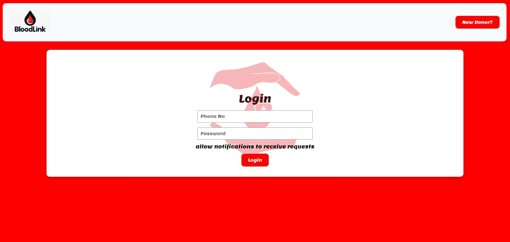
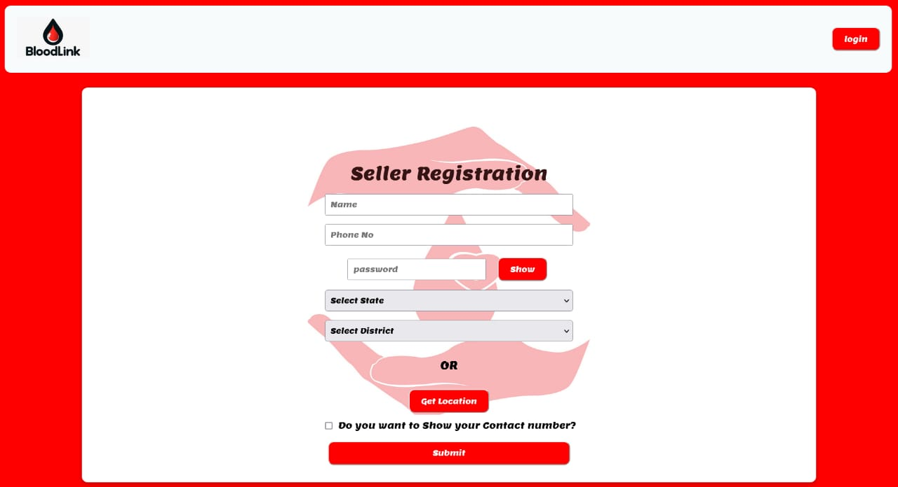
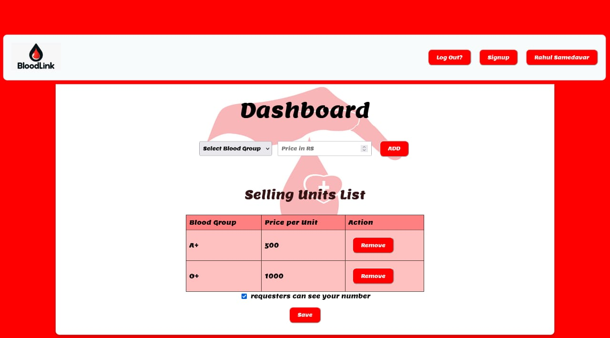
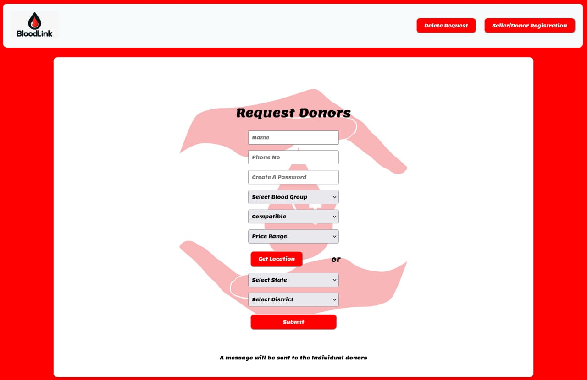
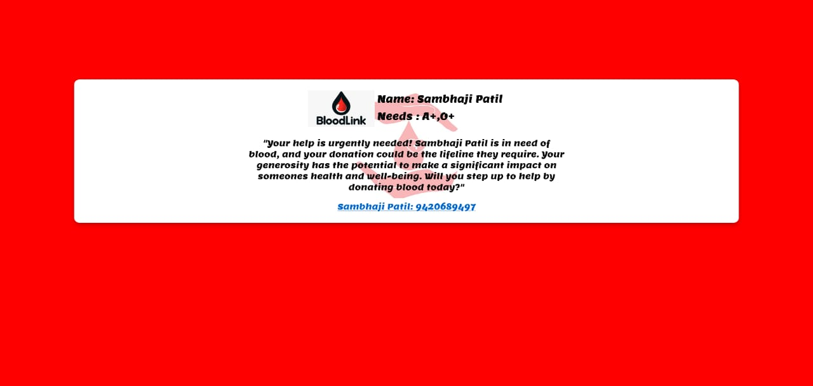
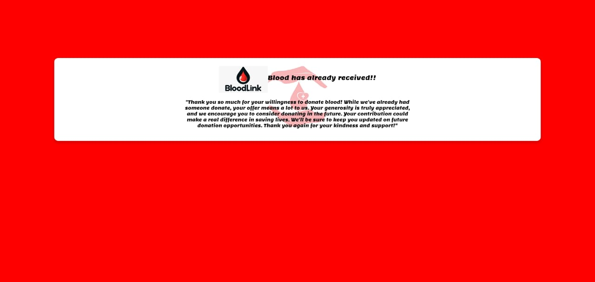

# BloodLink - Connecting Donors & Patients in Need  

**BloodLink** is a platform that connects blood donors with those in urgent need. Donors can register with their blood type, location, and minimum price for donation. Recipients can request blood by specifying their required type, location, and the maximum price they can afford.  

## Features  
- **🩸 Donor Registration** – Donors can sign up with their blood type, location, and availability.  
- **🔍 Blood Requests** – Recipients can request blood by specifying type, location, and budget.  
- **📍 Smart Matching** – Nearby compatible donors receive notifications for urgent requests.  
- **📞 Direct Contact** – Donors can choose to reveal the recipient’s contact details if willing to donate.  
- **✅ Request Management** – Once a recipient secures a donation, they can mark the request as fulfilled.  

## How It Works  
1. **Sign Up** – Donors register with their details and preferences.  
2. **Request Blood** – Users in need submit a request with blood type and location.  
3. **Get Notified** – Compatible donors receive real-time notifications.  
4. **Connect & Donate** – Interested donors contact recipients and arrange the donation.  

## Tech Stack  
- **Backend:** Node.js, Express, MySQL  
- **Frontend:** HTML, CSS, JavaScript  
- **Notifications:** Firebase Cloud Messaging (FCM) / WebSockets  

